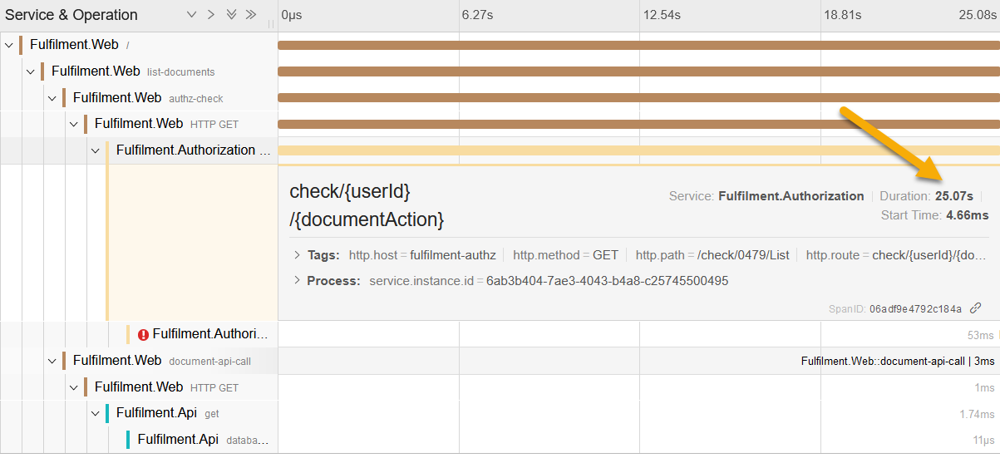
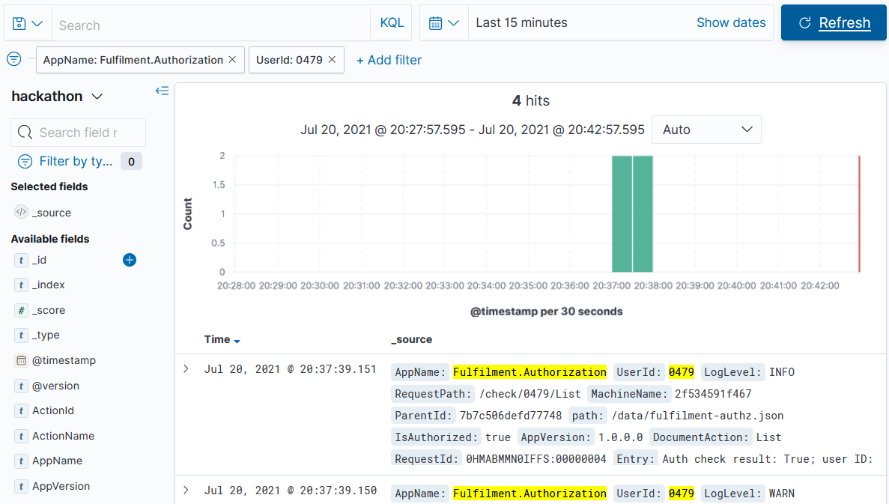

# Hackathon - Part 1 Sample Solution

There are lots of approaches to this, your investigation might be completely different but get the same answer **and that's fine**.

## Identify the slow component

In a distributed app we first need to narrow down which part of the call stack is taking the time, and we can use traces for that.

Browse to http://localhost:8080, enter user ID `0479` and click _Go_. You'll see the response takes around 25 seconds.

Open the Jaeger UI and search for:

- Service: `Fulfilment.Web`
- Operation: `all`
- Tags: `user.id=0479`

You won't necessarily know that the traces contain a user ID tag, but the data's there to be explored - you can look at any website trace to see what kind of tags the components are setting.

> In the trace you'll see it's a span from the `Fulfilment.Authorization` service causing the issue.

It's not clear why it's happening, but that span is taking 25 seconds, and the span following it shows an error:



Now we know where the problem is, we can do a targeted search in Kibana, filtering so we have a small set of logs to work through:

- AppName: `Fulfilment.Authorization`
- UserId: `0479`

You'll see just a handful of logs (4 for each time you made the document list request):



Expand the documents and you'll see a warning log:

```
Identity provider call failed! Defaulting to: True. IDP: https://identity.sixeyed.com/authn; user ID: 0479
```

And immediately before that there's an info log:

```
Using experimental identity provider for configured user. IDP: https://identity.sixeyed.com/authn; user ID: 0479
```

> So it looks like there's a new identity provider service being trialled for some users. It's not working too well, so we need to flag that with the fulfilment authorization team.
