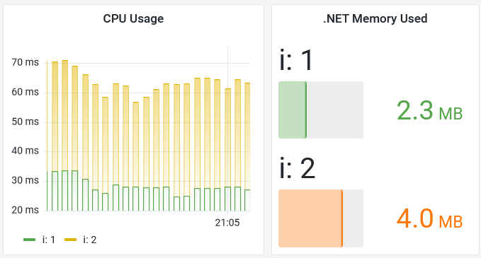
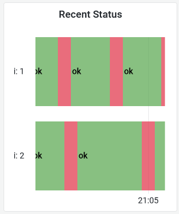
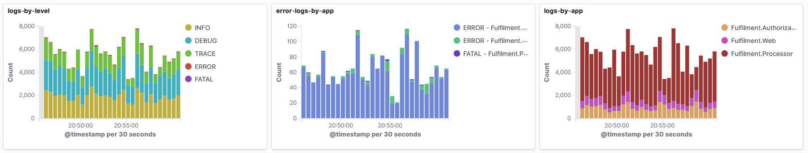
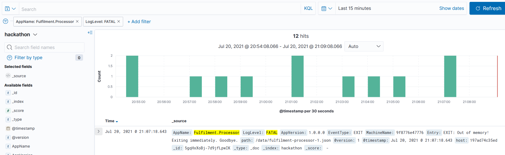

# Hackathon - Part 2 Sample Solution

As before - lots of ways to look into this problem, and if you come up with a similar answer to mine through a different approach **that's all good**.

## Build out saturation graphs

To see how hard a component is working, we can build a Grafana dashboard with CPU and memory usage over time. 

This is similar to work we did in the [Grafana lab](../../labs/grafana/README.md) - but the data is slightly different, so the PromQL is not the same.

The CPU query will find the rate of CPU consumption over time, split by instance - we need a rate as this is a counter:

```
sum without(job) (rate(process_cpu_seconds_total{job="fulfilment-processor"}[5m]))
```

Memory is simpler because it's recorded in a gauge:

```
dotnet_total_memory_bytes{job="fulfilment-processor"}
```

You'll see very low numbers - a few megabytes of memory and <100ms of CPU time:



> It looks like the apps are working well within their capacity, but we also need to check if they're working **properly**.

Build out an uptime panel to see if the processor is healthy:

```
sum without(job) (up{job="fulfilment-processor"})
```

Expand the timeframe and you'll see the instances are restarting regularly - you can import the sample dashboard from the file `hackathon/solution/grafana-part2.json`:



We'll need to dig a bit more. In Kibana, build out a dashboard showing counts of logs - this is useful to have for all applications:

- by log level, showing how many logs of each type are being generated
- by application, showing how many logs each component is generating
- filtering for errors and fatal logs, split by application name

> All these can be _Area_ visualizations, using a _Date histogram_ for the x-axis, and splitting the series by different fields for each graph: `LogLevel`, `AppName`, and one with two splits - `LogLevel` and `AppName`

This shows at a glance which apps are logging, the spread of log levels and which apps are logging errors - you can import the sample dashboard from the file `hackathon/solution/kibana.ndjson`:



This shows there are FATAL logs being recorded by the `Fulfilment.Processor` component, so that confirms we have an issue and narrows down the search space - so it's off to the _Discover_ tab. Filter on:

- LogLevel: `FATAL`
- AppName: `Fulfilment.Processor`

You'll see just a handful of log entries like this:



The text of the logs is always the same:
```
EXIT: Out of memory! Exiting immediately. Goodbye.
```

> Looks like the processors are getting saturated on memory after all. We do need to scale, but **up** rather than **out**, giving the instances more memory to work with.
