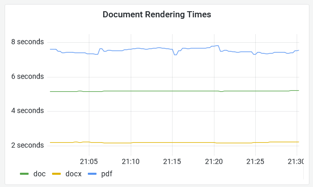
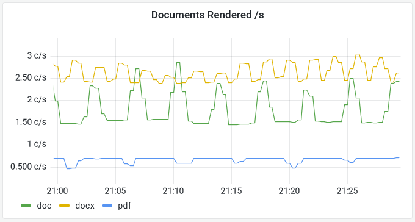

# Hackathon - Part 3 Sample Solution

Last one, and if you get a similar answer to mine - however you get there - I say **good job**.

## Explore the problem area

This is a processing time question - which type of document takes longest to render, and we know rendering is done when users submit documents through the web app.

We'll start in Jaeger to get an idea of the range of processing times - search for traces:

- Service: `Fulfilment.Web`
- Operation: ` Submit`
- Limit Results: `100`
- _remember to clear the Tag field_
- _set a recent time range - e.g. the last 2 minutes_

You'll see traces taking anything from 1s to 8s:


That's a pretty big range, so we should dig more.

## Build a percentile processing time graph

In Prometheus check the metrics list, and you'll find a histogram called `web_document_prerender_seconds`; run a query on `web_document_prerender_seconds_bucket` and you'll see we're already collecting rendering time by document type.

That's lucky :)

A percentile would be good here, to lose outliers and get the processing time for 90% of documents, split by document type:

```
histogram_quantile(0.90, sum without(instance, job)(rate(web_document_prerender_seconds_bucket[5m])))
```

Build that into a Grafana panel and you'll see we're only dealing with three document types - and one has a consistently higher processing time than the others:




But that's not the whole story - there's no point optimizing for PDFs unless they're commonly used.

Build a Grafana panel showing a count of documents rendered per second, split by document type:

```
sum without(instance, job)(rate(web_document_prerender_seconds_count[5m]))
```

You'll see that there's a wide spread of popularity for the different document types - you can load the sample dashboard from `hackathon/solution/grafana-part3.json`:



> The two graphs together show that PDFs take the longest time to render, but they're the least common format. DOCX is the most common, but it's also the fastest. DOC is the second most common and the second slowest, so that's probably the best bet for optimizing.