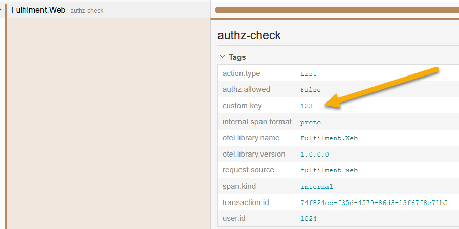

# Lab Solution

Baggage is part of context propagation, like the trace parent ID.

Make an HTTP call with the `baggage` header containing any key-value pair, and you'll see it propagated in the Jaeger trace:

```
curl -H "baggage: custom.key=123" localhost:8070/index?userId=1024
```

All the spans will have access to the custom baggage item, which gets copied as tags in the demo app:



So now all you need to do is set the right feature flag in the originating request:

```
curl -H "baggage: authz.skip=true" localhost:8070/index?userId=1024
```

> You'll get the full document list in the response, which that user is not authorized to see

Checks the logs in the authorization service and you'll see that the baggage value has been sent on by the web app in the API call:

```
docker logs obsfun_fulfilment-authz_1 -n 2
```