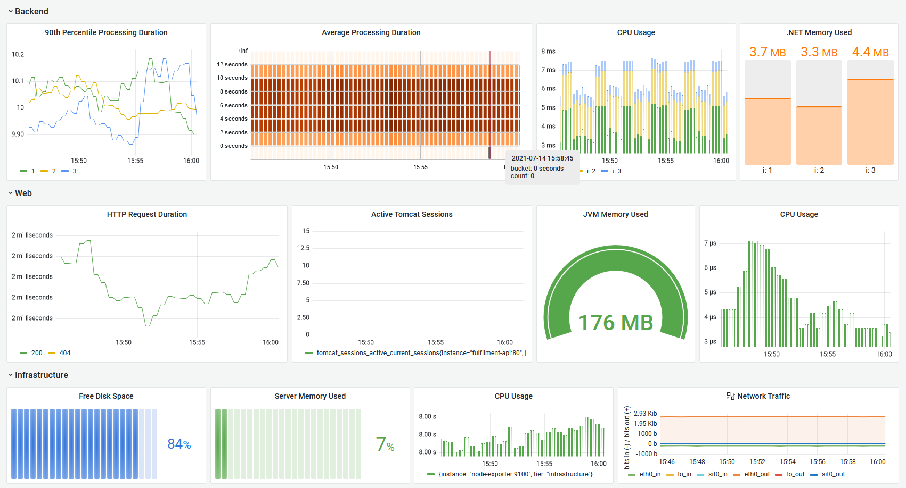

# Building Grafana Dashboards

It's easy to go overboard with visualizations and build fancy panels for every metric you capture. There will be too much information if you have more than a dozen or so panels on your dashboard, and it will stop being effective. You should build your dashboards starting from wireframe where you sketch out panels which answer the questions you have about the status of your app.

## Reference
 
- [Best practices for creating dashboards](https://grafana.com/docs/grafana/latest/best-practices/best-practices-for-creating-dashboards/)
- [Sample dashboards](https://grafana.com/grafana/dashboards) - official and community-built examples
- [Grafana configuration](https://grafana.com/docs/grafana/latest/administration/configuration/)
- [Automatic provisioning for Grafana](https://grafana.com/docs/grafana/latest/administration/provisioning/)

## Run Prometheus & Grafana

We'll run the metrics components in Docker containers again, but this time we'll make use of the automation options so we don't need to configure a data source manually:

- [metrics.yml](./metrics.yml) - Prometheus and Grafana, with custom configuration files
- [datasource-prometheus.yml](./config\grafana\datasource-prometheus.yml) - provisioning to set up the Prometheus data source
- [custom.ini](.\config\grafana\custom.ini) - custom configuration settings

Run the metrics containers:

```
docker-compose -f labs/grafana-dashboard/metrics.yml up -d
```

> Browse to Grafana at http://localhost:3000

Sign in with the configured credentials:

- username: `admin`
- password: `obsfun`

We're using the light theme by default now; browse to http://localhost:3000/datasources and you'll see Prometheus is already configured.

Prometheus is running too, using a new configuration:

- [prometheus.yml](./config\prometheus.yml) - we have the `tier` label, and a new label for the document processor - `instance_number`; that will have 1, 2 or 3 which is easier to work with than the full instance label.

> Browse to http://localhost:9090/service-discovery

Click _show more_ for the fulfilment processor job, and you'll see the new target labels which will be applied to all metrics.

## Visualzing counters and gauges

We're going to build a dashboard for the demo app, focusing on some of the [SRE Golden Signals](https://sre.google/sre-book/monitoring-distributed-systems/):

> TODO - jamboard sketch

Different visualizations work better for different types of data. In these exercises you'll be given the PromQL and some guidance, but you don't need to represent panels exactly as they are here.

All our components record memory usage

> TO HERE

Saturation - Memory

- dotnet 

try in prometheus: dotnet_total_memory_bytes

build into bar gauge:

- units: bytes (SI)
- thresholds: orange 3MB, red 5MB 
- legend: intance_number


- java

try jvm_memory_used_bytes

sum without(instance, job, tier, id, area) (jvm_memory_used_bytes{job="fulfilment-api"})

build into gauge

- units: bytes (SI)
- thresholds: orange 190MB, red 250MB 

- vm

(node_memory_MemTotal_bytes - node_memory_MemFree_bytes - node_memory_Buffers_bytes - node_memory_Cached_bytes - node_memory_SReclaimable_bytes) / node_memory_MemTotal_bytes 

- bar gauge
- units: percentage
- min 0, max 1.0
- horizontal


CPU:

- sum without(instance, job) (rate(process_cpu_seconds_total{job="fulfilment-processor"}[5m]))
- sum without(job) (rate(process_cpu_usage{job="fulfilment-api"}[5m]))
- sum without(job, cpu, mode) (rate(node_cpu_seconds_total[5m]))

## Visualzing summaries and histograms

- java api records http_server_requests_seconds_count and http_server_requests_seconds_sum
- summary type
- use to calculate averages

 sum by(status) (rate(http_server_requests_seconds_sum{job="fulfilment-api"}[5m])) - avg processing time
 sum by(status) (rate(http_server_requests_seconds_count{job="fulfilment-api"}[5m])) - avg number reqs

 sum by(status) (rate(http_server_requests_seconds_sum{job="fulfilment-api"}[5m])) /  sum by(status) (rate(http_server_requests_seconds_count{job="fulfilment-api"}[5m])) - average duration by status

- unit: duration (s)

> coarse average, reduces data volumes but no way to get breakdowns

fulfilment_processing_seconds_bucket

- count of instances per bucket

histogram_quantile(0.90, rate(fulfilment_processing_seconds_bucket[5m]))

- 90th percentile processing times, per instance

- any aggregation needs to be done before the quantile:

histogram_quantile(0.90, sum without(instance, job, tier)(rate(fulfilment_processing_seconds_bucket[5m])))


Grafana

- histogram_quantile into time series
- avg by(le) (rate(fulfilment_processing_seconds_bucket[5m])) into bar gauge; legend={{le}}, format=heatmap


## Lab


histogram into heatmap

add network usage from https://grafana.com/grafana/dashboards/405

build full dashboard:




