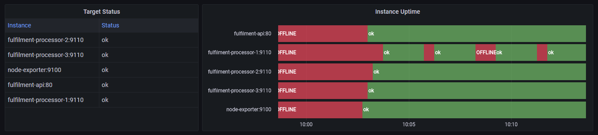

## Run Grafana

- grafana.yml
- labs\grafana\config\prometheus.yml adds `tier` label

docker-compose -f labs/grafana/grafana.yml up -d

http://localhost:9090/targets

> Down, not running yet

http://localhost:3000

- username: admin
- password: admin

> Skip new password

Add data source:

- Prometheus
- http://prometheus:9090

> Save & test

## Create a new dashboard

_Create...Dashboard_

Add empty panel:

- visualization preview
- data source (bottom panel 0 query & transform)
- display options (right panel)

- Metrics browser: promql, `up`
- top right, _time series_ is visualization option
- switch to _table_
- back in query panel - switch to format=table and check _Instant_

To change data - either change query or edit representation

- sum without(job, tier) (up)
- _transform_ panel
- _organize fields_ - hide Time, rename others
- in table panel to right, _value mappings_ - transform 0 to OFFLINE and 1 to ok
- click apply

## Visualization Types

Start apps

- apps.yml

docker-compose -f labs/grafana/apps.yml up -d

- back in grafana, set auto-refresh to 5s - see instances come online

build a graph of uptime

- add panel
- sum without(job, tier) (up)
- vis type: state timeline
- change threshold - base = red, next = 1, green
- legend {{instance}}
- legend mode: hidden
- add same value mapping

- set time to last (e.g.) 15 minutes

## Lab

Split into rows and filter data:

- infrastructure with node instance
- web with fulfilment-api instance
- backend with processor instances
- save dashboard

