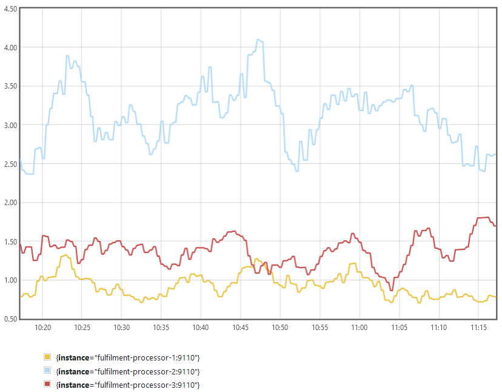

# Querying Metrics with PromQL

Prometheus uses its own query language - PromQL. It has operators for comparing metrics and performing maths, and functions for aggregation and manipulation of data. It's quite a complex language, but you can get a lot of the data you want with just a little knowledge.

## Reference

- [PromQL basics](https://prometheus.io/docs/prometheus/latest/querying/basics/)
- [Operators](https://prometheus.io/docs/prometheus/latest/querying/operators/)
- [Functions](https://prometheus.io/docs/prometheus/latest/querying/functions/)
- [PromQL intro and cheatsheet](https://sysdig.com/blog/getting-started-with-promql-cheatsheet/)

## Understanding labels

We've seen labels in the [Prometheus lab](../prometheus/README.md), but they become more useful the more metrics you collect.

In this lab we'll run Prometheus along with multiple instances of the document processor app, all configured to produce slightly different metric values:

- [compose.yml](compose.yml) - has the container setup for all the components
- [prometheus.yml](./config\prometheus.yml) - configures Prometheus will multiple targets for the processor job

Run the containers:

```
docker-compose -f labs/promql/compose.yml up -d
```

> Browse to Prometheus at http://localhost:9090/targets

Click the _show more_ button to see the three targets, and refresh to see them come online.

The target page shows the `instance` and `job` labels; these are the  labels which Prometheus adds to every metric.

📋 When all the targets are up, query the `app_info` metric in the graph page. What do the results tell you?

<details>
  <summary>Need some help?</summary>

Switch to the [graph page](http://localhost:9090/graph) and enter `app_info` as the expression. 

You'll see results like this:

| Element | Value |
|--------|------ |
| `app_info{app_version="1.3.1", assembly_name="Fulfilment.Processor", dotnet_version="3.1.16", instance="fulfilment-processor-1:9110", job="fulfilment-processor"}` | `1` |
| `app_info{app_version="1.3.1", assembly_name="Fulfilment.Processor", dotnet_version="3.1.16", instance="fulfilment-processor-2:9110", job="fulfilment-processor"}` | `1` |
| `app_info{app_version="1.5.2", assembly_name="Fulfilment.Processor", dotnet_version="3.1.16", instance="fulfilment-processor-3:9110", job="fulfilment-processor"}` | `1` |

Every metric has the same `job` label, but different `instance` labels - so there is one for each running instance of the same logical component.

This is an informational metric, the value is always `1` - it's the labels we care about. The `app_version` label tells us one instance is running a different version of the code than the other two. 

</details><br/>

Metric labels are all treated and stored in the same way, but they have different sources:

-  _target labels_ like `job` and `instance` are added by Prometheus when it scrapes the target; you won't see them in the app's /metrics endpoint
- _instrumentation labels_ like `app_version` are added by the app when it collects the data; you **will** see theses in the /metrics endpoint

Labels are used to filter and aggregate metrics in queries.

## Selection

The `fulfilment_requests_total` has instrumentation and target labels. 

You can filter by label values with this PromQL syntax: 

> `metric_name{label_name="label_value"}`

📋 Run queries to show metrics for all statuses from instance 1, and then for the failed status from all instances. 

<details>
  <summary>Need some help?</summary>

Instance labels are unique, but there are multiple status labels for each instance. This will return failed and processed counts for instance 1:

```
fulfilment_requests_total{instance="fulfilment-processor-1:9110"}
```

e.g.

| | |
|-|-|
|`fulfilment_requests_total{instance="fulfilment-processor-1:9110", job="fulfilment-processor", status="failed"}`| `898`|
|`fulfilment_requests_total{instance="fulfilment-processor-1:9110", job="fulfilment-processor", status="processed"}` | `20861`|

For all instances, you can filter on the status label:

```
fulfilment_requests_total{status="failed"}
```

e.g.

| | |
|-|-|
|`fulfilment_requests_total{instance="fulfilment-processor-1:9110", job="fulfilment-processor", status="failed"}`|`1035`|
|`fulfilment_requests_total{instance="fulfilment-processor-2:9110", job="fulfilment-processor", status="failed"}`|`3666`|
|`fulfilment_requests_total{instance="fulfilment-processor-3:9110", job="fulfilment-processor", status="failed"}`|`1522`|

</details><br/>

The metrics from these apps are all randomly generated, but you'll see a much higher number of failures from one instance, probably instance 2. Looks like there could be an issue with that instance, but we'll need to dig deeper.

## Simple aggregation

Prometheus has a custom query language because relational database languages like SQL can't easily express all Prometheus' features.

Aggregation with labels is simple with PromQL, this queries the total successful document processing count:

```
sum(fulfilment_requests_total{status="processed"})-sum(fulfilment_requests_total{status="failed"})
```

You'll see a single number because we're aggregating across label values - summing the processed count for all instances and then subtracting the sum of the failure count for all instances.

Labels let you aggregate data across different facets. Try these queries:

- `sum (fulfilment_requests_total)` - all documents, with every status and instance (_for this particular metric, that double-counts the failures_);
- `sum by (instance) (fulfilment_requests_total{status="processed"})` - sum of all processed documents, split by instance
- `sum without(job, instance) (fulfilment_requests_total)` - aggregates the specified labels, splitting by any which aren't specified; this splits by status

Aggregation operators include `max` and `avg`, but you need to be sure you're querying the right thing. Try these:

- `max without(job, instance) (fulfilment_in_flight_total)` might look like it's going to give you the maximum number of in-flight documents since the metrics began, but it's not; 

- `fulfilment_in_flight_total` is an instant vector, showing the current value of the in-flight gauge for all instances; the `max` operator over that just returns the maximum number in flight of the latest values, not over time.

To aggregate over time you need to include a timespan, making the results into a range vector.

## Aggregation over time

You select a time range with square brackets: 

> `metric_name[10m]`

📋 Run a query to show the in-flight values for all instances from the last five minutes, and then find the maximum within that range. 

<details>
  <summary>Need some help?</summary>

This produces a range vector:

```
fulfilment_in_flight_total[5m]
```

You can't use `max` because that picks the top result from an instant vector - **this will error**:

```
max without(job, instance) (fulfilment_in_flight_total[5m])
```

Instead use `max_over_time` which works on range vectors:

```
max_over_time (fulfilment_in_flight_total[5m])
```

That result is an instant vector, so now you can `max` over it:

```
max without(job, instance)(max_over_time (fulfilment_in_flight_total[30m]))
```

</details><br/>

Range vectors are used to show trends, which makes sense for gauges - but less so for counters.

Run this query over a counter metric and show the results in a graph:

```
sum without(job,status) (fulfilment_requests_total)
```

> Counters always increase, so the graph is always increasing

What we really want is to show the rate at which the counter increases over time:

- `fulfilment_requests_total[5m]` - returns a range vector with values from the last 5 minutes

- `rate(fulfilment_requests_total[5m])` - returns an instant vector which shows the per-second increase in the counter, averaged over the range

The `rate` function returns a gauge (because the rate of change can go up or down), so you can use the usual aggregation operators.

📋 Build a graph showing the rate that documents have failed processing, over the last five minutes, with lines for each instance. 

<details>
  <summary>Need some help?</summary>

Use the `sum` aggregation over the `rate` function to remove the job and status labels:

```
sum without(job,status) (rate(fulfilment_requests_total[5m])) 
```

And include a label selector to show just the failed status:

```
sum without(job,status) (rate(fulfilment_requests_total{status="failed"}[5m])) 
```

Switch to the graph view and you'll see something like this:



</details><br/>

Your graph should show instance 2 is producing a lot more failures. Instance 3 should have the fewest. Maybe the new app version is an improvement, and we should upgrade the other instances too?

## Lab

Actually, the rate of failures is only half of the story - we need to know the ratio of failures to the number of documents being processed.

Build a query to show the average failure ratio over the last five minutes, split by application version.

There's a lot to this, so you'll want to start with simpler queries and build up:

- q1: average failures per second, per instance
- q2: average processed per second, per instance
- q3: average failure ratio (q1 / q2)
- q4: average failure ratio joined with app version (q3 grouped with `app_info`)
- q5: q4 with instance label removed

> Stuck? Try [hints](hints.md) or check the [solution](solution.md).

___
## Cleanup

Cleanup by removing all containers:

```
docker rm -f $(docker ps -aq)
```