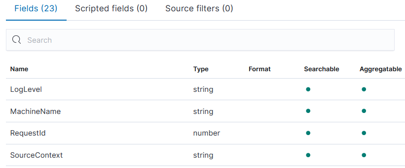

# Searching with the Query DSL

Search functionality in Elasticsearch depends very much on the format of your data. In these exercises we'll spend more time exploring the Query DSL, and we'll also look at specifying data types for document fields.

## Reference

- [Match queries](https://www.elastic.co/guide/en/elasticsearch/reference/current/query-dsl-match-query.html) - searching for words and phrases
- [Term queries](https://www.elastic.co/guide/en/elasticsearch/reference/current/term-level-queries.html) - searching for exact matces
- [Explicit mapping](https://www.elastic.co/guide/en/elasticsearch/reference/current/explicit-mapping.html) - configuring field types for documents
- [42 query dsl examples](https://coralogix.com/blog/42-elasticsearch-query-examples-hands-on-tutorial/) - some useful query examples

## Run the ELK stack and demo apps

We'll start by running everything in containers to produce a stream of incoming data:

- [compose.yml](./compose.yml) - specifies the ELK containers using the same setup we've had before to push data into Logstash

Run the ELK containers:

```
docker-compose -f labs/query-dsl/compose.yml up -d
```

> Check Kibana at http://localhost:5601 - when it's running then Elasticsearch is ready too

We'll also run the fulfilment processor app we've used already in the course:

- [processor-log.yml](./processor-log.yml) - configures the app to run in a container, writing to an unstructured log file in the same data directory which Logstash is using.

Start the demo app:

```
docker-compose -f ./labs/query-dsl/processor-log.yml up -d
```

Logstash will see the log file and monitor it. Any new lines will get processed by this pipeline:

- [pipelines/fulfilment-log-to-es.conf](./pipelines/fulfilment-log-to-es.conf) 

📋 What do you think this pipeline is doing?

<details>
  <summary>Need some help?</summary>

There are the usual three parts to the pipeline:

- the `input` block looks for log files in the `/data` directory

- the `filter` block uses a grok Regular Expression to parse the log lines, set the timestamp from the log entry - and it includes a translation to convert the short log levels (e.g. `DBG`) to standard levels (`DEBUG`)

- the `output` block writes to Elasticsearch using a fixed index name

</details><br/>

Now the processor is writing lots of fake log lines, which Logstash is sending to Elasticsearch. 

We can see them in Kibana - create an index pattern for `fulfilment-log` and check the logs in the _Discover_ tab.

There will be lots, and we can stop the processor now so we don't get any more:

```
docker stop obsfun_fulfilment-processor_1
```

Explore the data and you'll see it's only partially structured. The `entry` field contains a request ID, but there's not a separate field for that so you can't filter on all logs for one request.

Filtering is an important part of the Query DSL because filters either include or exclude documents. Elasticsearch doesn't need to caclculate a match score for every document which can save a lot of processing time, and filter results will be cached if they're used by multiple queries.

## Queries and filters

We'll use Kibana to explore the DSL for queries and filters.

Open up the [Kibana Console](http://localhost:5601/app/dev_tools#/console) and try some _term queries_.

This query looks for the term _Error: Document service unavailable_ in the log `entry` field:

```
GET /fulfilment-log/_search?pretty
{ 
    "query": 
    { 
        "term":  
        {
            "entry" : 
            {
                "value": "Error: Document service unavailable"
            }
        }
    } 
}
```

📋 There will be lots of documents containing that log text. How many do you think the query will return?

<details>
  <summary>Need some help?</summary>

Run the query and you'll see there are zero hits. The response tells you the query was successful, so there isn't a syntax error or a problem with Elasticsearch - there are just 0 results.

</details><br/>

> Term queries are for _exact matches_. Documents are only included if the field data is the same as the query, there's no match for different cases or punctuation.

📋 Write a query to find all documents where the `source` field has the exact value `fulfilment_processor`, and return just the first document.

<details>
  <summary>Need some help?</summary>

This is where you will use a term query:

```
GET /fulfilment-log/_search?pretty&size=1
{ 
    "query": 
    { 
        "term":  
        {
            "source" : 
            {
                "value": "fulfilment_processor"
            }
        }
    } 
}
```

You should see lots of hits, my response contains this JSON:

```
  "hits" : {
    "total" : {
      "value" : 10000,
      "relation" : "gte"
    }
```

That says there are >10K matching documents. The `size` parameter returns just the first document, so you can check the `source` field has the expected content.

</details><br/>

If you want a broader search, you can use a _match query_. This finds any documents where the `entry` field _contains_ the words in the search term:

```
GET /fulfilment-log/_search?pretty&size=1
{ 
    "query": 
    { 
        "match":
        {
          "entry": "error service unavailable"
        }
    }
}
```

Run the query and look at the result - the response is sorted by descending score values by default. The response document includes all the search words, but not the exact phrase.

Try the same query but sort the results on _ascending_ score, so the first document will have the lowest score:

```
GET /fulfilment-log/_search?pretty&size=1
{ 
    "sort" : [
        {"_score": "asc"}
    ],
    "query": 
    { 
        "match":
        {
          "entry": "error service unavailable"
        }
    }
}   
```

> This response just has the word "error" in the entry field. Match queries look for _any word_ in the search term, but more matching words means a higher score. 

There are other types of match query. In the console hit _Ctrl+Space_ in the `match` field to see other options.

📋 Run a query to find the exact phrase "Error: Document service unavailable". Is this type of search case sensitive?

<details>
  <summary>Need some help?</summary>

You can use the `match_phrase` query here:

```
GET /fulfilment-logs/_search?pretty&size=1
{ 
    "query": 
    { 
        "match_phrase":
        {
          "entry": "error document service unavailable"
        }
    }
}
```

You'll find fewer hits than the previous search, because documents which only have the word "error" aren't a match.

</details><br/>

> Phrase matches need to have all the words in the search term, in the same order - but case and punctuation are ignored, so "Error: Document service unavailable" matches the search "error document service unavailable".

We've got just a couple more examples for this exercise. Some types of query can include a `filter` block - the filter runs first to exclude any documents which don't match, and then the query runs to score the matching documents.

This query filters for error logs before querying on the log entry text:

```
GET /fulfilment-log/_search?pretty&size=1
{
  "query": {
    "bool": {
      "must": {
        "match": {
          "entry": "error service unavailable"
        }
      },
      "filter": {
        "term": {
          "level.keyword": "ERROR"
        }
      }
    }
  }
}
```

> You'll get the same number of hits as the original query, but Elasticsearch filters out most of the documents before it runs the query, so this is much more efficient.

How efficient the filter is depends on your documents. In this application there are far fewer error logs than other levels - and we can use an aggregation query to check that:

```
GET /fulfilment-log/_search?pretty&size=0
{
  "aggs": {
    "level": {
      "terms": { "field": "level.keyword" }
    }
  }
}
```

📋 What is this query aggregating? What split of data do you see?

<details>
  <summary>Need some help?</summary>

This creates an aggregation called `level` over the field called `level.keyword`, which is a field automatically created by Elasticsearch. 

When I run the query, I get this response:

```
  "aggregations" : {
    "level" : {
      "doc_count_error_upper_bound" : 0,
      "sum_other_doc_count" : 0,
      "buckets" : [
        {
          "key" : "DEBUG",
          "doc_count" : 21942
        },
        {
          "key" : "TRACE",
          "doc_count" : 11538
        },
        {
          "key" : "ERROR",
          "doc_count" : 567
        }
      ]
    }
  }
```

</details><br/>

> The aggregation over the log level shows almost 40x more debug logs than errors, and about half as many trace logs as debugs.

That "keyword" field was added by Elasticsearch when it created the index. You don't have a fixed schema for Elasticsearch documents, but different data types are treated differently - and that's set in the index _mapping_.

## Explicit mappings

Mappings are created automatically when you create a document in a new index - Elasticsearch looks at the incoming data and infers the data type of each field.

Check the mapping created for the log index:

```
GET /fulfilment-log/_mapping?pretty
```

You'll see the `@timestamp` field is a date type, but all the other fields are text types with an additional sub-field:

```
  "entry": {
    "type": "text",
    "fields": {
      "keyword": {
        "type": "keyword",
        "ignore_above": 256
      }
    }
  }
```

This means Elasticsearch indexes two fields for the `entry` field in incoming documents:

- `entry` - uses the full contents of the field, useful for match queries
- `entry.keyword` -  is a keyword type you can use for filtering; this takes the beginnging of the field, up to 256 characters.

> You can **only** filter text with keyword fields, and in the default mapping every text field has a keyword - that's how we were able to filter and aggregate on the log level.

Field types matter - filters need to use keywords for text, and you need date or number types for ranges. 

Using structured data gives us more search and filter options, and we can run the processor demo app to produce strucutured logs like this:

```
{
  "Timestamp": "2021-07-08T11:18:23.1448393+01:00",
  "Entry": "Fulfilment.Processed: Request ID: 30615888",
  "Level": "Debug",
  "EventType": "Fulfilment.Processed",
  "RequestId": 30615888,
  "SourceContext": "Fulfilment.Processor.Program",
  "MachineName": "SC-WIN10-I7",
  "AppVersion": "1.0.0.0"
}
```

To make the best use of this data we want to explicitly define the field types, rather than rely on Elasticsearch to infer them. We can do that by creating a new index before adding any documents, setting the mapping for specific field types.

Run this to create a new index for the structured log format:

```
PUT /fulfilment-json
{
  "mappings": {
    "properties": {
      "LogLevel": {"type": "keyword"},
      "MachineName": {"type": "keyword"},
      "EventType": {"type": "keyword"},
      "RequestId": {"type": "integer"},
      "SourceContext": {"type": "keyword"},
      "AppVersion": {"type": "keyword"}
    }
  }
}
```

> This is not a data schema :) Documents which don't have these fields will still be added to the index, and any extra fields will have their data type inferred. 

You only need mappings for the fields you care most about - this index uses keywords for all the main pieces of data, and an integer for the request ID.

Now we can run the document processor configured to generate JSON logs (from [processor-json.yml](./processor-json.yml)):

```
docker-compose -f ./labs/query-dsl/processor-json.yml up -d
```

Logstash is already configured with a pipeline to process those JSON logs:

- [pipelines/fulfilment-json-to-es.conf](./pipelines/fulfilment-json-to-es.conf) - this uses the JSON filter which is more reliable and efficient than parsing with RegEx or CSV

There will be new structured logs in Elasticsearch now. In Kibana add an index pattern for `fulfilment-json`, and have a closer look at the field list. You'll see fields with an explicit mapping are flagged as  _Searchable_ and _Aggregatable_:



Switch to the _Discover_ tab and select the `fulfilment-json` index pattern. You should have lots of logs, so we can stop the demo app now:

```
docker stop obsfun_fulfilment-processor_1
```

Back in the _Discover_ tab, the fields and mappings make for very precise searches. 

📋 Using filters and searches, find documents with these criteria:

- LogLevel: ERROR
- SourceContext: Fulfilment.Processor.DocumentProcessor
- AppVersion: 1.0.0.0
- EventType: Fulfilment.Failed
- RequestId: between 30M and 32M
- ErrorMessage: contains "unavailable"

<details>
  <summary>Need some help?</summary>

Most fields can be filtered on. From the field list on the left, click each one and add the value you want to see - that will give you the first four criteria.

For the ID range, click _+ Add filter_ and select `RequestId` with the operator `is between`, and use 30000000 and 32000000 as the range.

The last field can be added to the search box: `ErrorMessage: unavailable`.

</details><br/>

We could have millions of log entries, but we're able to filter down to a small subset - and then we're running a very efficient search query.

## Lab

Kibana is great for exploring data, but under the scenes it's just building up Query DSL to send to Elasticsearch.

Try to replicate the filter you have in the _Discover_ page using Query DSL.

> Stuck? Try [hints](hints.md) or check the [solution](solution.md).

___
## Cleanup

Cleanup by removing all containers:

```
docker rm -f $(docker ps -aq)
```