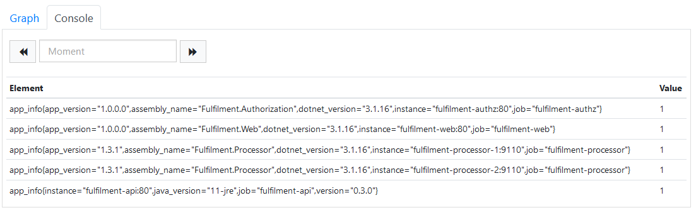
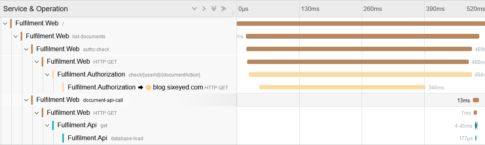
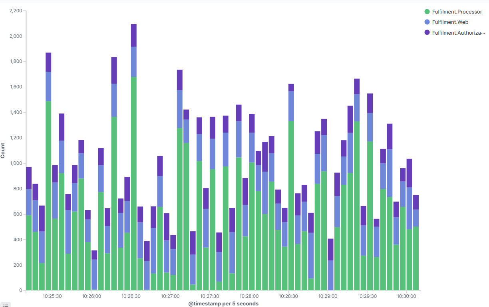

# Troubleshooting Apps in Kubernetes

Observability is all about plugging your applications into collectors - Prometheus for metrics, Logstash for logs and Jeager for traces.

Those collectors are each part of their own subsystem, which need to plug into other components.

There is **a lot** of configuration between all these things, making sure the pieces can talk to each other and that they're sending information in the expected format to the expected location.

Plenty of things can go wrong in the setup, which will manifest as your apps missing logs or metrics, or parts of traces not being reported.

## Lab

This one is all lab :) 

There are four sets of containers to run:

- [metrics.yml](./metrics.yml) - Prometheus (we won't use Grafana this time round)
- [logging.yml](./logging.yml) - the ELK stack
- [tracing.yml](./tracing.yml) - Jaeger
- [apps.yml](./apps.yml) - application containers
- [load.yml](./load.yml) - a load-test tool ([Fortio](https://fortio.org/)), configured to send requests to the web app to generate instrumentation 

Start all the containers:

```
docker-compose -f labs/troubleshooting/metrics.yml -f labs/troubleshooting/logging.yml -f labs/troubleshooting/tracing.yml -f labs/troubleshooting/apps.yml -f labs/troubleshooting/load.yml up -d
```

> Browse to the app at http://localhost:8070 and list the documents for the default user, to check the app is OK

Your goal is to get the observability stack working correctly and reporting everything:

- the metrics in Prometheus at http://localhost:9090 should show an `app_info` metric for every component instance:



- the `Fulfilment.Authorization` service traces in Jaeger at http://localhost:16686 should show 10 spans:



- an area visualization in Kibana at http://localhost:5601 showing count of documents over time, split by `AppName` and by `MachineName`, should show four application instances writing logs:



This is not meant to be a Docker troubleshooting exercise - all the app and networking configuration is in Docker Compose, so there may be issues there or in the observability component configuration.

When you find issues, update the files to fix them and run this to restart the containers:

```
docker-compose -f labs/troubleshooting/metrics.yml -f labs/troubleshooting/logging.yml -f labs/troubleshooting/tracing.yml -f labs/troubleshooting/apps.yml restart
```

Don't go straight to the solution! These are the sort of issues you will get all the time, so it's good to start working through the steps to diagnose problems.

> Stuck? Try [hints](hints.md) or check the [solution](solution.md).

___
## Cleanup

Cleanup by removing all containers:

```
docker rm -f $(docker ps -aq)
```